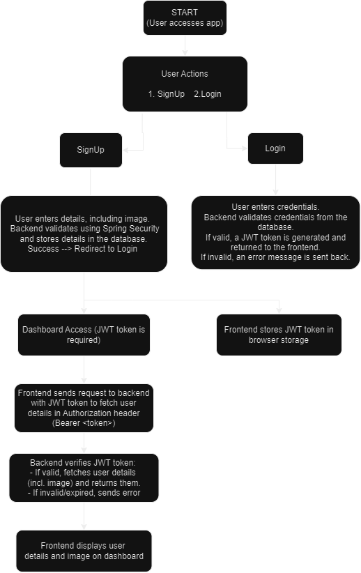
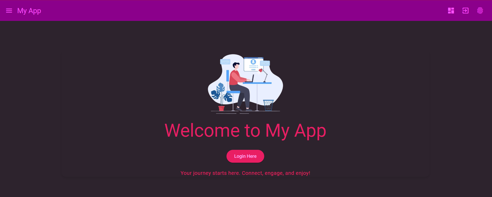
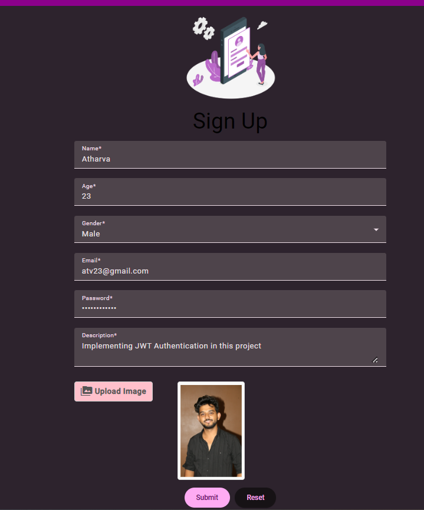
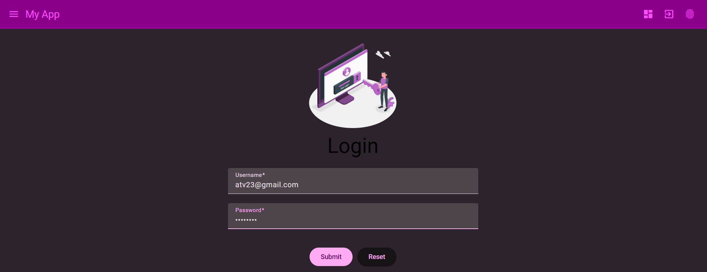
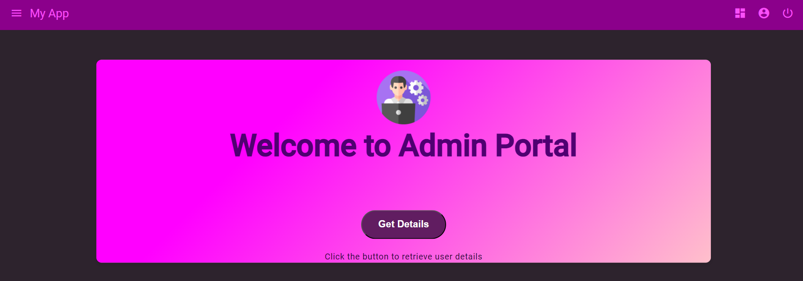
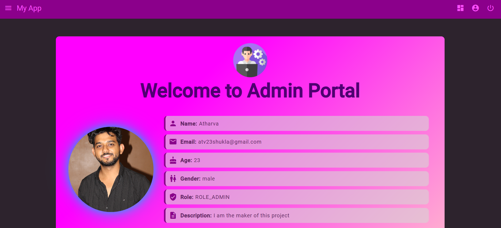

# JWT Secure Auth System

**JWT Secure Auth System** is a user authentication and authorization system built with Angular on the frontend and a Spring Boot-based backend. This project implements user signup, login, and JWT-based token authentication to secure API requests for fetching user details and other protected routes.

## Features

- **User Signup**: Open registration for new users.
- **User Login**: Secure login system with JWT token generation.
- **JWT Authentication**: Protects routes and user data using JSON Web Tokens.
- **Token-Based Requests**: Tokens are attached to requests to fetch user details securely.
- **Secure Dashboard**: After logging in, users can view their details on a personalized dashboard.
- **Database Support**: User details, including encrypted passwords, are securely stored in a MySQL database.
- **Image Upload and Display**: Users can upload images that are stored on the server and displayed in their dashboard.

## Tech Stack

### Frontend:
- **Framework**: Angular
- **Language**: TypeScript, HTML, CSS

### Backend:
- **Framework**: Spring Boot (Java)
- **Authentication**: JWT (JSON Web Tokens)
- **Database**: MySQL
- **Security**: Spring Security for authentication and authorization

## Project Structure

### Frontend (Angular):
- `src/app`: Contains Angular components, services, and routing logic for authentication (login/signup) and dashboard views.
- `src/app/services`: Contains services for handling user authentication, managing JWT tokens, and making HTTP requests.
- `src/app/components`: Includes reusable UI components such as the login form, signup form, and user dashboard.

### Backend (Spring Boot):
- `src/main/java/com/jwt`: Includes controllers, models, and services for handling user authentication and authorization.
- `src/main/resources/application.properties`: Backend configuration (e.g., database, security settings).
- **JWT Management**: The backend generates and validates JWT tokens during user authentication.
- **Spring Security**: Ensures that only authenticated users with valid tokens can access protected routes.

## How It Works

1. **Signup**: Users can create an account by signing up through the Angular frontend, filling their details. All registered users are stored in the MySQL database. After successful server side validation, user is redirected to login screen.
2. **Login**: After login, the backend generates a JWT token, which is returned to the client along with response.
3. **Token Storage**: The JWT token is securely stored in the client's browser (localStorage).
4. **Authenticated Requests**: For subsequent requests to fetch user details or access protected resources, the frontend attaches the JWT token in the Authorization header (`Bearer <token>`).
5. **Token Validation**: The backend verifies the token's validity for each protected request using Spring Security.

## Flow Diagram

Below is the flow diagram that outlines the authentication process.


*Figure 1: JWT Authentication Flow Diagram*

## User Interface Screenshots

### Landing Page

*Figure 2: Landing Page of Application*

### Signup Page

*Figure 3: User Signup Interface*

### Login Page

*Figure 4: User Login Interface*

### Dashboard Page

*Figure 5: User Dashboard After Successful Login*

### User Details Page

*Figure 6: User Details fetched by User*


## Installation

### Prerequisites

- **Node.js**: Install the latest version of Node.js [here](https://nodejs.org/).
- **Angular CLI**: Install Angular CLI globally using the command:
  ```bash
  npm install -g @angular/cli
- **Java**: Ensure that JDK 8 or higher is installed.
- **Maven**: Install Maven for building the Spring Boot backend.
- **MySQL**: Set up a MySQL database for storing user data.

## Backend Setup (Spring Boot)

1. Clone the repository:

 ```bash
 git clone https://github.com/your-username/jwt-secure-auth-system.git
 cd jwt-secure-auth-system/backend
 ```

2. Configure the database in the application.properties file:
 ```properties
 spring.application.name=jwtAuthentication
 server.port=8081
 spring.datasource.name= ds
 spring.datasource.url=jdbc:mysql://localhost:3306/your_database
 spring.datasource.username=your_username
 spring.datasource.password=your_password
 spring.datasource.driver-class-name= com.mysql.cj.jdbc.Driver
 spring.jpa.properties.hibernate.dialect=org.hibernate.dialect.MySQLDialect
 spring.jpa.hibernate.ddl-auto=update
 spring.servlet.multipart.enabled=true
 spring.servlet.multipart.max-file-size=10MB
 spring.servlet.multipart.max-request-size=10MB
 ```
 
3. Build and run the backend:
 ```bash
  mvn clean install
  mvn spring-boot:run
```
## Frontend Setup (Angular)

1. Navigate to the frontend folder and install the required dependencies:
 ```bash
  cd jwt-secure-auth-system/frontend
  npm install
 ```
2. Run the Angular development server:
 ```bash
  ng serve
 ```
3. Open your browser and navigate to `http://localhost:4200.`

## API Endpoints

### Authentication Endpoints:
- **POST** `/signup`: Register a new user (stores user details in MySQL).
- **POST** `/token`: Log in an existing user and receive a JWT token.

### Protected Endpoints:

- **GET** `/getuser`: Fetch user details (requires JWT token).
- **Other protected routes**: All other routes require a valid JWT token for access and are secured using Spring Security.

### Security Considerations

- **Token Expiry**: Ensure JWT tokens have an expiration time to prevent misuse.
- **HTTPS**: Always use HTTPS for secure communication.
- **Token Storage**: Store the JWT token securely in localStorage or sessionStorage in the browser. Avoid using cookies unless they're secured and HTTP-only.
- **Spring Security**: Leverages Spring Security to validate and authenticate tokens on protected routes.

## JWT Token Generation Workflow

1. **User Login Request**  
   The user sends a login request (`POST /token`) with their username and password in the body.

2. **Validate Input**  
   The backend validates that both the username and password fields are not null or empty. If either is missing, a `BAD_REQUEST` response is returned.

3. **Authentication Process**  
   The `AuthenticationManager` is used to authenticate the user's credentials by comparing them with stored user data (using `UsernamePasswordAuthenticationToken`). If authentication fails, an exception is thrown.

4. **Load User Details**  
   If authentication is successful, the user’s details (username, roles, etc.) are fetched from the `CustomUserDetailsService`.

5. **Generate JWT Token**  
   The `JwtUtil` class generates a JWT token based on the authenticated user's details (username, roles, etc.).

6. **Return JWT Token**  
   The generated token is wrapped in a `JwtResponse` object and returned to the client with a `CREATED` response status.

7. **Client Stores Token**  
   The client (frontend) receives the token, stores it (in `localStorage`), and includes it in the Authorization header (`Bearer <token>`) for subsequent requests to protected routes.

## Future Enhancements
- **Password Reset**: Add functionality for users to reset their passwords.
- **Role-Based Access Control**: Implement roles (e.g., admin, user) to restrict access to certain endpoints.
- **Refresh Tokens**: Add refresh tokens to extend the user session without requiring re-login.

## Contributing
Contributions are welcome! Please fork this repository, create a new branch for your feature or bug fix, and submit a pull request.